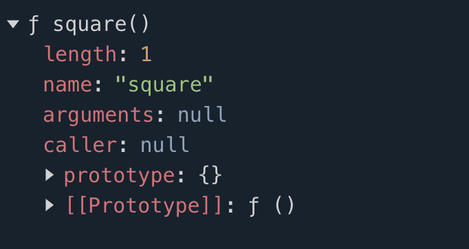
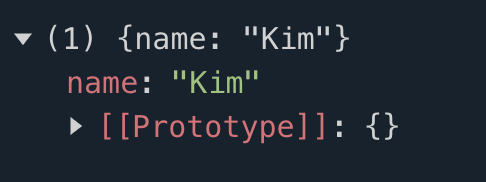
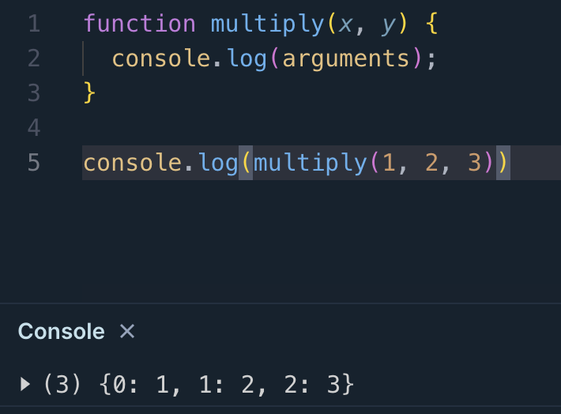

## 일급 객체


> 다음과 같은 조건을 만족하는 객체를 **일급 객체** 라 한다.
>
- 무명의 리터럴로 생성할 수 있다.

    ```jsx
    const increase = function (num) {
      return ++num;
    };
    ```

- 변수나 자료구조(객체, 배열 등)에 저장할 수 있다.

    ```jsx
    const decrease = function (num) {
      return --num;
    };
    ```

- 함수의 매개 변수에 전달할 수 있다.
- 함수의 반환값으로 사용할 수 있다.

    ```jsx
    function makeCounter(aux) {
      let num = 0;
    
      return function () {
        num = aux(num);
        return num;
      };
    }
    
    const increaser = makeCounter(auxs.increase);
    console.log(increaser()); // 1
    console.log(increaser()); // 2
    ```


함수가 일급 객체라는 의미는 객체와 동일하게 사용할 수 있다는 의미인데, 객체는 값이므로 함수는 값과 동일하게 취급할 수 있다.

함수와 객체를 동일하게 사용할 수 있지만, 일반 객체와 함수는 차이가 있다. 일반 객체는 호출할 수 없지만 함수는 호출할 수 있다. 또한 함수 고유의 프로퍼티가 있다.






## 함수의 객체의 프로퍼티


### 1. arguments

> 함수 호출 시 전달된 인수들의 정보를 담고 있는 순회 가능한 유사 배열 객체
>
- 자바스크립트는 함수의 매개변수와 인수의 개수가 일치하는지 확인하지 않는다.
- 초과된 인수는 arguments 객체의 프로퍼티로 보관된다.




arguments 객체는 매개변수 개수를 확정할 수 없을 때 유용하게 사용될 수 있다.

```jsx
function sum() {
  let res = 0;

  // arguments 객체는 length 프로퍼티가 있는 유사 배열 객체이므로 for 문으로 순회할 수 있다.
  for (let i = 0; i < arguments.length; i++) {
    res += arguments[i];
  }

  return res;
}

console.log(sum());        // 0
console.log(sum(1, 2));    // 3
console.log(sum(1, 2, 3)); // 6
```

```jsx
function sum() {
  // arguments 객체를 배열로 변환
  const array = Array.prototype.slice.call(arguments);
  return array.reduce(function (pre, cur) {
    return pre + cur;
  }, 0);
}

console.log(sum(1, 2));          // 3
console.log(sum(1, 2, 3, 4, 5)); // 15
```

```jsx
// ES6 Rest parameter
function sum(...args) {
  return args.reduce((pre, cur) => pre + cur, 0);
}

console.log(sum(1, 2));          // 3
console.log(sum(1, 2, 3, 4, 5)); // 15
```

### **💡 arguments 객체 vs. Rest parameters 차이점**

- `arguments` 객체는 **유사 배열 객체** 형태 인자 정보를 담고 있다. `반면에 Rest 파라미터`는 함수에 전달된 인수들의 목록을 **배열**로 전달받습니다.

```jsx
function sumRestParameter(...args) {
  console.log(args);
}

function sumArguments() {
  console.log(arguments);
}

sumRestParameter(1, 2, 3); // [1, 2, 3]
sumArguments(1, 2, 3); // {0: 1, 1: 2, 2: 3}
```

- 가변 인자 함수를 구현할 때, arguments 객체의 `caller`, `length` 프로퍼티를 이용하여 구현해야 하는 경우에는 `arguments` 객체를 이용하는 것이 유용하다.
- 인자 정보를 이용해 **배열 메서드를 사용해야 하는 경우**에는 `Rest parameters` 를 사용하는 것이 번거로움을 피할 수 있다. 또한 화살표 함수 자체는 arguments 객체를 갖지 않으므로, **화살표 함수로 구현해야 할 때**는 반드시 Rest 파라미터를 사용해야 한다.

### 2. caller 프로퍼티

> 함수 자신을 호출한 함수를 가리킨다.
>

### 3. length 프로퍼티

> 함수를 정의할 때 선언한 매개변수의 개수를 가리킨다.
>

```jsx
function lengthTest() {}

console.log(lengthTest.length); // 0

function lengthTest2(x) {}

console.log(lengthTest2.length); // 1
```

### 4. name 프로퍼티

> 함수의 이름을 나타낸다.
>

```jsx
// 기명 함수 표현식
var namedFunc = function foo() {};
console.log(namedFunc.name); // foo

// 익명 함수 표현식
var anonymousFunc = function() {};
// ES5: name 프로퍼티는 빈 문자열을 값으로 갖는다.
// ES6: name 프로퍼티는 함수 객체를 가리키는 변수 이름을 값으로 갖는다.
console.log(anonymousFunc.name); // anonymousFunc

// 함수 선언문(Function declaration)
function bar() {}
console.log(bar.name); // bar
```

### 5. __proto__ 접근자 프로퍼티

> `[[Prototype]]` 내부 슬롯이 가리키는 프로토타입 객체에 접근하기 위해 사용하는 접근자 프로퍼티
>

```jsx
 📚 hasOwnProperty 메서드는 인수로 전달받은 프로퍼티 키가 객체 고유의 프로퍼티 키인 경우에 true
    상속받은 프로토타입의 프로퍼티 키인 경우는 false 를 반환한다.
```

### 6. prototype 프로퍼티

> 생성자 함수로 호출할 수 있는 constructor 만 소유할 수 있는 프로퍼티.
>
>
> prototype 프로퍼티는 함수가 객체를 생성하는 `생성자 함수`로 호출될 때 생성자 함수가 생성할 인스턴스의 프로토타입 객체를 가리킨다.
>

```jsx
// 함수 객체는 prototype 프로퍼티를 소유한다.
(function () {}).hasOwnProperty('prototype'); // -> true

// 일반 객체는 prototype 프로퍼티를 소유하지 않는다.
({}).hasOwnProperty('prototype'); // -> false
```

## Key Point

- 자바스크립트에서 함수가 일급 객체라는 것의 의미
- arguments 객체와 Rest parameters 이용했을 때의 차이점
- 유사 배열 객체의 개념