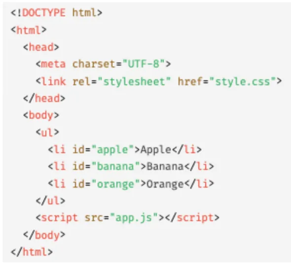
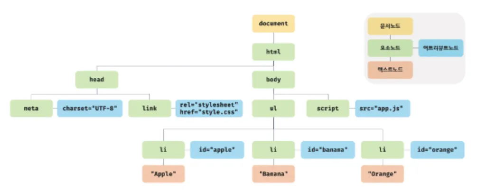
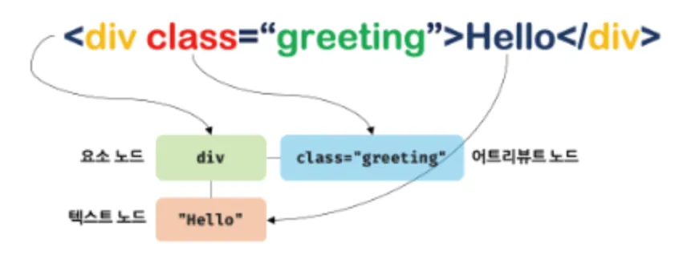
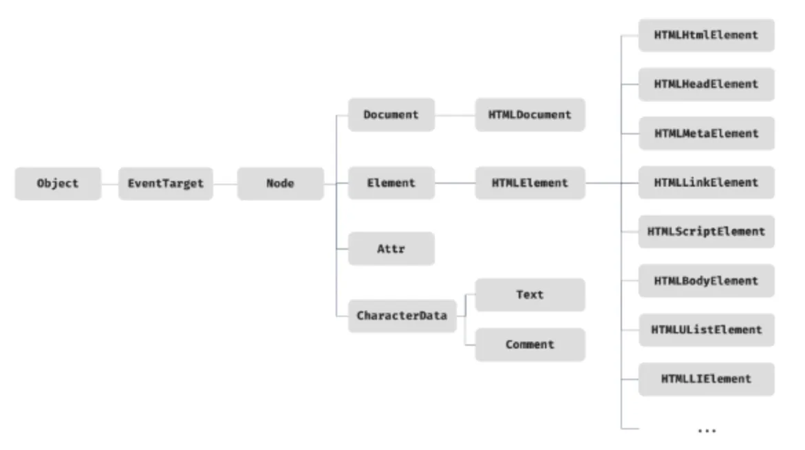
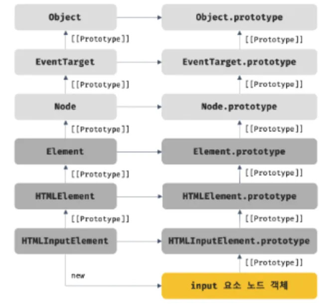

## 39.1 노드

- DOM
  <br>
  <br>

  왼쪽 HTML 문서를 파싱해서 오른쪽 DOM을 생성

- 브라우저의 렌더링 엔진은 HTML 문서를 파싱해서 브라우저가 이해할 수 있는 자료구조인 DOM을 생성
- DOM(Document Object Model)은 HTML 문서의 계층적 구조/정보를 표현, 이를 제어하는 API → 프로퍼티와 메서드를 제공하는 트리 자료구조
- HTML 요소와 노드 객체
  <br>

  - HTML 요소
    - HTML 문서를 구성하는 개별적인 요소
    - 렌더링 엔진 의해 파싱 → DOM을 구성하는 요소 노드 객체로 변환
      - 어트리뷰트는 어트리뷰트 노드로, 텍스트 콘텐츠는 텍스트 노드로 변환
  - HTML 문서
    <br>

    - HTML 요소의 집합으로 구성
    - HTML 요소는 중첩 관계 가짐 → HTML 요소의 콘텐츠 영역(시작 태그와 종료 태그 사이)에는 텍스트뿐만 아닌 다른 HTML 요소도 포함 가능
    - HTML 요소 간 중첩으로 인해 계층적인 부자(parent-child) 관계 형성 → HTML 요소를 객체화한 모든 노드 객체들이 트리 자료구조를 구성하게 됨

  - 트리 자료구조
    - 노드들의 계층 구조로 구성 → 부모/자식 노드, 비선형 자료구조(하나의 자료 뒤에 여러 개의 자료가 존재할 수 있는 자료구조)
    - 하나의 최상위 노드(부모 노드 존재 X)에서 시작, 루트 노드(0개 이상의 자식 노드 가짐)라고 부름
    - 리프 노드: 자식 노드가 없는 노드
    - DOM: 노드 객체로 구성된 트리 자료구조 (위에서 잠깐 언급했던 내용)
  - DOM 노드 객체
    - 총 12개의 종류가 있는데 일단 그 중에서 제일 중요한 건 4가지
      - 문서 노드: DOM의 최상위에 존재, document 객체를 가리킴
      - 요소 노드: HTML 요소를 가리키는 객체
      - 어트리뷰트 노드: HTML의 어트리뷰트를 가리키는 객체
      - 텍스트 노드: HTML의 텍스트를 가리키는 객체
  - 노드 객체의 상속 구조
    <br>

    - 상속받는 인터페이스 정리
      - 모든 노드 객체는 Object, EventTarget, Node 인터페이스를 상속받음
    - 프로토타입 체인 관점
      <br>

      - ex) input 요소를 파싱하여 객체화한 input 요소 노드 객체
        - HTMLInputElement, HTMLElement, Element, Node, EventTarget, Object의 prototype에 바인딩되어 있는 프로토타입 객체를 상속받음
        - input 요소 노드 객체는 프로토타입 체인에 있는 모든 프로토타입의 프로퍼티/메서드를 상속받아 사용 가능

  - DOM은 HTML 문서의 계층적 구조/정보를 표현하고, 노드 타입에 따라 필요 기능을 DOM API로 제공함 → HTML의 구조/내용/스타일 등을 동적으로 조작

<br>

## 39.2 요소 노드 취득

- 요소 노드를 취득해야 하는 이유
  - HTML의 구조나 내용 또는 스타일 등을 동적으로 조작하기 위해
  - ex) h1 요소의 텍스트를 변경하고 싶음 → h1 요소 노드를 취득해야 함 → 취득한 요소 노드의 자식 노드인 텍스트 노드를 변경 → h1 요소의 텍스트 변경됨
  - 요소 노드를 취득하기 위해 DOM은 다양한 메서드 제공
- id를 이용한 요소 노드 취득 - Document.prototype.getElementById
  - 인수로 전달한 id 값을 갖는 하나의 요소 노드를 탐색하여 반환
    ```jsx
    <li id='banana'>Banana</li>
    ...
    // id 값이 'banana'인 요소 노드를 탐색하여 반환
    const $elem = document.getElementById('banana');
    ```
  - 중복된 id 값을 갖는 요소가 여러 개 있을 수 있음 → 인수로 전달된 id 값을 갖는 첫 번째 요소 노드만 반환
  - getElementById 메서드는 언제나 단 하나의 요소 노드를 반환
- 태그 이름을 이용한 요소 노드 취득 - Document.prototype.getElement”s”ByTagName / Element.prototype.getElement”s”ByTagName
  - 인수로 전달한 태그 이름을 갖는 모든 요소 노드들을 탐색하여 반환
    ```jsx
    <li id='banana'>Banana</li>
    ...
    // 태그 이름이 li인 요소 노드를 모두 탐색하여 반환
    const $elems = document.getElementsByTagName('li');
    ```
  - 탐색된 요소 노드들은 HTMLCollection 객체에 담겨 반환
    - 여러 개의 값이 반환됨 → 함수는 하나의 값만 반환할 수 있으므로 배열/객체와 같은 자료구조에 담겨져 반환됨
    - HTMLCollection 객체는 유사 배열 객체이면서 이터러블
- class를 이용한 요소 노드 취득 - Document.prototype.getElementsByClassName / Element.prototype.getElementsByClassName
  - 인수로 전달한 class 값을 갖는 모든 요소 노드들을 탐색하여 반환
    ```jsx
    <li class='fruit apple'>Apple</li>
    <li class='fruit banana'>Banana</li>
    ...
    // class 값이 'fruit'인 요소 노드를 모두 탐색하여 반환
    const $elems = document.getElementsByClassName('banana');
    ```
  - 탐색된 요소 노드들은 HTMLCollection 객체에 담겨 반환
- CSS 선택자를 이용한 요소 노드 취득 1 - Document.prototype.querySelector / Element.prototype.querySelector
  - 인수로 전달한 CSS 선택자를 만족시키는 하나의 요소 노드를 탐색하여 반환
    ```jsx
    <li class='apple'>Apple</li>
    ...
    // class 어트리뷰트 값이 'apple'인 첫 번째 요소 노드를 탐색하여 반환
    const $elem = document.querySelector('.apple');
    ```
- CSS 선택자를 이용한 요소 노드 취득 2 - Document.prototype.querySelector”All” / Element.prototype.querySelector”All”
  - 인수로 전달한 CSS 선택자를 만족시키는 모든 요소 노드들을 탐색하여 반환
    ```jsx
    <ul>
    	<li class='apple'>Apple</li>
    	<li class='banana'>Banana</li>
    </ul>
    ...
    // ul 요소의 자식 요소인 li 요소를 모두 탐색하여 반환
    const $elems = document.querySelectorAll('.apple');
    ```
    - NodeList 객체를 반환, 이 객체는 유사 배열 객체이면서 이터러블
- 특정 요소 노드를 취득 - Element.prototype.matches
  - 인수로 전달한 CSS 선택자를 통해 특정 요소 노드를 취득할 수 있는지 확인
    ```jsx
    <ul id='fruits'>
    	<li class='apple'>Apple</li>
    	<li class='banana'>Banana</li>
    </ul>
    ...
    // $apple 노드는 '#fruits > li.apple'로 취득 가능
    console.log($apple.matches('#fruits > li.apple')); // true
    // $apple 노드는 '#fruits > li.banana'로 취득 불가능 (banana니까)
    console.log($apple.matches('#fruits > li.banana')); // false
    ```
    - 이벤트 위임을 사용할 때 유용 (챕터 40에서 더 자세히 배움)

<br>

## 39.3 노드 탐색

- 요소 노드를 취득하고, 트리를 옮겨다니며 노드를 탐색해야 할 때가 있음
  - DOM 트리 상의 노드를 탐색할 수 있도록 Node/Element 인터페이스는 트리 탐색 프로퍼티를 제공함
  - 프로퍼티 종류에 대해서만 간략하게 정리하고 넘어가기…
- Document.prototype.getElementById
  - 인수로 전달한 id 어트리뷰트 값 요소 노드를 탐색하여 단 하나의 요소 노드를 반환
  - 일치하는 노드가 없으면 null을 반환
- Node.prototype.childNodes, Element.prototype.children
  - 자식 노드를 탐색
    ```jsx
    console.log($fruits.childNodes);
    ```
- Node.prototype.hasChildNodes
  - 자식 노드가 존재하는지 확인
  - 불리언 값을 반환, 리프 노드라면 텍스트 노드를 포함
    ```jsx
    console.log($fruits.hasChildNodes()); // true
    ```
- Node.prototype.parentNode
  - 부모 노드를 탐색
    ```jsx
    console.log($banana.parentNode); // ul#fruits
    ```
- Node.prototype.previousSibling,Node.prototype.nextSibling
  - 형제 노드를 탐색
    ```jsx
    // li.banana의 형제 노드 탐색하기
    ...
    const { previousElementSibling } = nextElementSibling;
    console.log(previousElementSibling); // li.apple
    ```

<br>

## 39.4 노드 정보 취득

- 노드 객체에 대한 정보를 취득할 때 노드 정보 프로퍼티를 사용
  - 위에서 프로퍼티 사용했던 방법과 동일하게 사용, 예제 생략…
- Node.prototype.nodeType
  - 노드 객체의 종류(타입)을 나타내는 상수를 반환
  - Node.ELEMENT_NODE: 요소 노드 타입을 나타내는 상수 1을 반환
  - Node.TEXT_NODE: 텍스트 노드 타입을 나타내는 상수 3을 반환
  - Node.DOCUMENT_NODE: 문서 노드 타입을 나타내는 상수 9을 반환
- Node.prototype.nodeName
  - 노드 이름을 문자열로 반환
  - 요소 노드: 대문자 문자열로 태그 이름(”UL”, “LI” 등) 반환
  - 텍스트 노드: 문자열 “#text”를 반환
  - 문서 노드: 문자열 “#document”를 반환

<br>

## 39.5 요소 노드의 텍스트 조작

- 위에서 살펴본 것들은 전부 읽기 전용 접근자 프로퍼티, 이제부터는 참조/할당 모두 가능한 프로퍼티 나옴
- Node.prototype.nodeValue
  - 노드 객체의 값(텍스트)를 가져올 수 있고(getter), 설정할 수 있음(setter)
- Node.prototype.textContent
  - 요소 노드의 텍스트와 모든 자손 노드의 텍스트를 취득하거나 변경
  - HTML 마크업은 무시됨, 이와 유사한 동작을 하는 innerText 프로퍼티가 있는데, 지양하는 게 좋음
    - innerText 프로퍼티는 CSS에 순종적이라 visibility:hidden으로 지정된 요소 노드의 텍스트를 반환하지 않기 때문
    - textContent보다 느리기 때문

<br>

## 39.6 DOM 조작

- DOM 조작
  - 새로운 노드를 생성하여 DOM에 추가하거나 기존 노드를 삭제 또는 교체하는 것
  - DOM 조작시 리플로우와 리페인트 발생 가능 → 성능에 영향, 주의해서 다뤄야 함
- Element.prototype.innerHTML
  - 요소 노드의 콘텐츠 영역 내에 포함된 모든 HTML 마크업을 문자열로 반환
  - 사용자로부터 입력받은 데이터를 그대로 innerHTML에 할당하는 것은 크로스 사이트 스크립팅 공격에 취약하므로 위험
  - 구현이 간단하고 직관적이지만 삽입될 위치를 지정할 수 없다는 단점
- Element.prototype.insertAdjancentHTML
  - 기존 요소를 제거하지 않으면서 위치를 지정해 새로운 요소를 반환
- 노드 생성과 추가
  - element.prototype.createElemenmt(tagName): 요소 노드를 생성
  - element.prototype.createTextNode(text): 텍스트 노드를 생성
  - Node.prototype.appendChild(childNode): 매개변수의 노드를 요소 노드의 마지막 자식 노드로 추가
- 복수의 노드 생성과 추가
  - 생성한 노드를 번번히 appendChild로 추가할 경우 DOM을 여러 번 변경하게 됨
  - 이를 회피하기 위해 DocumentFragment 노드를 사용할 수 있음
  - 노드 객체의 일종으로, 부모 노드가 없어서 기존 DOM과는 별도로 존재
  - 서브 DOM을 구성하여 기존 DOM에 추가하기 위한 용도로 사용
- 노드 삽입
  - Node.prototype.appendChild
    - 매개변수의 노드를 요소 노드의 마지막 자식 노드로 추가
    - 요소를 DOM에 추가할 수도 있지만 위치 지정이 불가능
  - Node.prototype.insertBefore
    - 첫 번째 인수로 전달받은 노드를 두 번째 인수로 전달받은 노드 앞에 삽입
- 노드 복사
  - Node.prototype.cloneNode
    - 노드의 사본을 생성하여 반환
    - 매개변수 deep에 true를 전달하면 깊은 복사로 자식 노드까지 복사되고, false를 전달하거나 생략하면 얕은 복사로 자식 노드를 제외한 노드 자신만의 사본을 생성
- 노드 교체
  - Node.prototype.replaceChild
    - 자신을 호출한 노드의 자식 노드를 다른 노드로 교체
- 노드 삭제
  - Node.prototype.removeChild(child)
    - child 매개변수에 인수로 전달한 노드를 DOM에서 삭제

<br>

## 39.7 어트리뷰트

- HTML요소는 여러 개의 어트리뷰트(속성)을 가질 수 있음
- HTML 요소의 시작 태그에 어트리뷰트 이름="어트리뷰트 값" 형식으로 정의
- 노드 요소의 모든 어트리뷰트 노드는 Element.prototype.attributes 프로퍼티로 취득
- 어트리뷰트 조작은 Element.prototype.getAttribute/setAttribute 메서드를 사용
- data 어트리뷰트(data- 접두사가 붙은 어트리뷰트)와 dataset 프로퍼티를 이용하면 HTML 요소에 정의한 사용자 정의 어트리뷰트와 자바스크립트 간 데이터를 교환할 수 있음
- HTML 어트리뷰트와 DOM 프로퍼티
  - HTML 어트리뷰트는 DOM에서 중복 관리되는 것처럼 보임, 그러나 요소 노드는 상태를 가지고 있으며, 초기 상태와 최신 상태 2개를 관리
  - HTML 어트리뷰트는 HTML요소의 초기 상태를 의미, 이는 변하지 않음, HTML 요소의 초기 상태는 어트리뷰트 노드에서 관리
  - DOM 프로퍼티는 사용자가 입력한 최신 상태를 관리, DOM 프로퍼티는 사용자의 입력에 의한 상태 변화에 반응하여 언제나 최신 상태를 유지
  - HTML 어트리뷰트와 DOM 프로퍼티는 반드시 1:1로 대응하는 것은 아님
    - ex) checkbox 요소의 checked 어트리뷰트 값은 문자열이지만 프로퍼티 값은 불리언 타입

<br>

## 39.8 스타일

- 인라인 스타일
  - HTMLElement.prototype.style 프로퍼티를 이용하여 케밥케이스 스타일로 인라인 스타일을 추가/변경할 수 있음
- CSS 클래스
  - 클래스 선택자를 이용하여 Element.prototype.className을 변경하여 미리 작성한 CSS class에 연결
- Element.prototype.classList 프로퍼티는 class 어트리뷰트의 정보를 잡은 DOMTokenList 객체를 반환
- DOMTokenList 객체는 add(...className), remove(...className), item(index), contains(className), replace(old,new), toggle(className[,force])의 유용한 메서드를 지원

<br>

## 39.9 DOM 표준

- HTML과 DOM 표준은 W3C와 WHATWG 두 단체가 협력하면서 공통 표준을 만들어 왔음
- 최근에 두 단체 서로 다른 표준 결과물 내놓음
- WHATWG이 단일 표준 내놓기로 두 단체가 합의함
