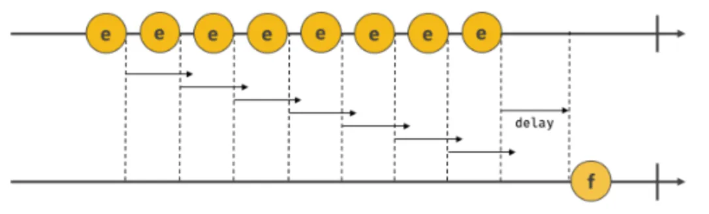

## 41.1 호출 스케줄링

- 호출 스케줄링
  - 함수를 명시적으로 즉시 호출하지 않고 일정 시간 경과 이후에 호출되도록 함수 호출 예약 위한 타이머 함수 사용 (비동기 처리 방식으로 동작)
- JS의 타이머 함수
  - 타이머 생성: setTimeout(), setInterval()
  - 타이머 제거: clearTimeout(), clearInterval()
  - 타이머 함수는 빌트인 함수 X 호스트 객체 O
- setTimeout(): 일정 시간 경과 후 콜백 함수 호출, 콜백 함수는 타이머 만료되면 “단 한 번” 호출됨
- setInterval(): 일정 시간 경과 후 콜백 함수 호출, 콜백 함수는 타이머 만료될 때마다 “반복” 호출됨

<br>

## 41.2 타이머 함수

- setTimeout / clearTimeout

  - setTimeout

    ```jsx
    const timeoutId = setTimeout(function, delay, param1, param2, ...);

    // function: 타이머 만료 후 호출될 콜백 함수
    // delay: 타이머 만료 시간
    // param: 호출 스케줄링된 콜백 함수에 전달해야 할 인수(가 존재할 때 사용)
    ```

    - 두 번째 인수로 전달받은 시간(ms)으로 단 한 번 동작하는 타이머 생성
    - 이후 타이머 만료되면 첫 번째 인수로 전달받은 콜백 함수 호출됨
    - delay 시간은 테스크 큐에 콜백 함수 등록하는 시간을 지연할 뿐 → 타이머 만료된다고 즉시 호출 보장 X
    - 생성된 타이머를 식별할 수 있는 고유한 타이머 id 반환 (브라우저 환경 - 숫자, Node.js 환경 - 객체)

  - clearTimeout

    ```jsx
    // 일단 타이머 만들기
    const timerId = setTimeout(() => console.log("Hi"), 1000);

    // 타이머 취소하기
    clearTimeout(timerId);
    ```

    - setTimeout 함수가 반환한 타이머 id를 clearTimeout 함수의 인수로 전달하여 타이머 취소 가능
    - 호출 스케줄링을 취소하는 역할

- setInterval / clearInterval
  - setInterval
    ```jsx
    const timerId = setInterval(function, delay, param1, param2, ...);
    ```
    - 두 번째 인수로 전달받은 시간(ms)으로 반복 동작하는 타이머 생성
    - 이후 타이머 만료될 때마다 첫 번째 인수로 전달받은 콜백 함수 반복 호출됨 → 타이머 취소될 때까지 계속됨
    - 생성된 타이머를 식별할 수 있는 고유한 타이머 id 반환
  - clearInterval
    ```jsx
    ...
    // 타이머 취소하기, cnt가 5 되면 취소하는 예제
    if (cnt++ === 5) clearInterval(timeoutId);
    ```
    - setInterval 함수가 반환한 타이머 id를 clearInterval 함수의 인수로 전달하여 타이머 취소 가능
    - 호출 스케줄링을 취소하는 역할

<br>

## 41.3 디바운스와 스로틀

- 디바운스와 스로틀
  - 짧은 시간 간격으로 연속해서 발생하는 이벤트를 그룹화해서 과도한 이벤트 핸들러의 호출을 방지하는 프로그래밍 기법
- 디바운스
  <br>

  - 짧은 시간 간격으로 이벤트가 연속해서 발생하면 이벤트 핸들러를 호출하지 않다가, 일정 시간이 경과한 이후에 이벤트 핸들러가 한 번만 호출되도록 함
  - 짧은 시간 간격으로 발생하는 이벤트를 그룹화해서 마지막에 한 번만 이벤트 핸들러 호출되도록 함
  - ex) 사용자가 입력 완료했을 때 한 번만 Ajax 요청을 전송하는 것이 바람직함
  - resize 이벤트 처리, input 요소에 입력된 값으로 ajax 요청하는 입력 필드 자동 완성 UI 구현, 버튼 중복 클릭 방지 처리 등에 유용하게 사용됨
  - 실무: Underscore/Lodash 라이브러리의 debounce 함수 사용 권장

- 스로틀
  <br>

  - 짧은 시간 간격으로 이벤트가 연속해서 발생하더라도 일정 시간 간격으로 이벤트 핸들러가 최대 한 번만 호출되도록 함
  - 짧은 시간 간격으로 연속해서 발생하는 이벤트를 그룹화해서 일정 시간 단위로 이벤트 핸들러가 호출되도록 호출 주기를 만듦
  - delay 시간 간격으로 콜백 함수가 호출됨
  - ex) scroll 이벤트 처리, 무한 스크롤 UI 구현 등에 유용하게 사용됨
  - 실무: Underscore/Lodash 라이브러리의 throttle 함수 사용 권장
