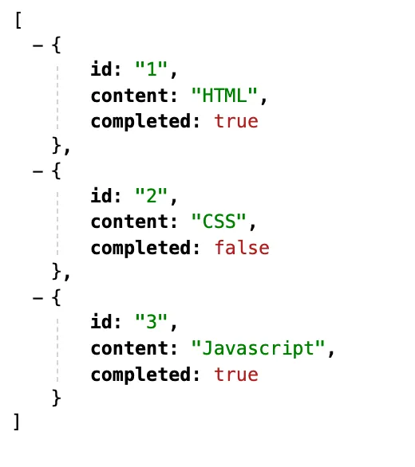
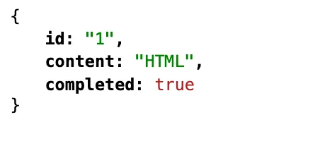
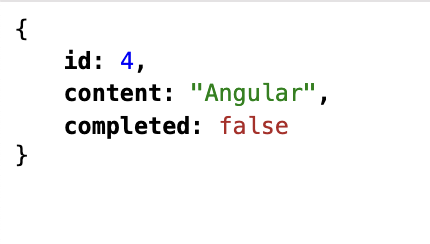
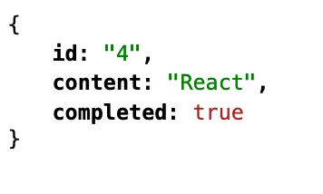
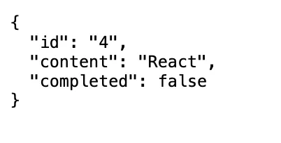
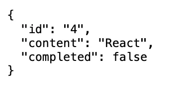

REST는 HTTP의 장점을 최대한 활용할 수 있는 아키텍처로서 HTTP 프로토콜을 의도에 맞게 디자인하도록 유도하고 있다. REST의 기본 원칙을 성실히 지킨 서비스 디자인을 "RESTful"이라 한다.

즉, REST는 HTTP를 기반으로 클라이언트가 서버의 리소스에 접근하는 방식을 규정한 아키텍처이고, REST API는 REST를 기반으로 서비스 API를 구현한 것을 의미한다.

<br/>

# REST API의 구성

REST API는 자원, 행위, 표현 3가지 요소로 구성된다. REST는 자체 표현구조로 구성되어 REST API만으로 HTTP 요청의 내용을 이해할 수 있다.

<br/>

# **REST API 설계원칙**

REST에서 가장 중요한 원칙은 두 가지다.

### **URI는 리소스를 표현해야 한다.**

리소스를 식별할 수 있는 이름은 동사보다는 명사를 사용한다. 따라서 이름에 get같은 행위에 대한 표현이 들어가서는 안된다.

```jsx
// bad
GET / getNags / 1;
GET / nags / show / 1;

// good
GET / nags / 1;
```

<br/>

### **리소스에 대한 행위는 HTTP 요청 메서드로 표현한다.**

리소스에 대한 행위는 HTTP 요청 메서드를 통해 표현하며 URI에 표현하지 않는다.

```jsx
// bad
GET /actions/delete/{actionId}

// good
DELETE /actions/{actionId}
```

<br/>

# **JSON Server를 이용한 REST API 실습**

HTTP 요청을 전송하고 응답을 받으려면 서버가 필요하다. JSON Server를 사용해 REST API 서버를 구축하여 HTTP 요청을 전송하는 실습을 진행해보자.

<br/>

## **JSON Server 설치**

JSON Server는 json파일을 사용하여 REST API 서버를 구축할 수 있는 툴이다.

```
cd json-server-exam
npm init -y
npm install json-server--save-dav
// 실행 시 command not fount 뜨면 sudo npm install -g json-server
```

<br/>

## **db.json 파일 생성**

프로젝트 루트 폴더에 다음과 같이 db.json파일을 생성한다. db.json 파일은 리소스를 제공하는 데이터베이스 역할을 한다.

```jsx
{
  "todos": [
    {
      "id": 1,
      "content": "HTML",
      "completed": true
    },
    {
      "id": 2,
      "content": "CSS",
      "completed": false
    },
    {
      "id": 3,
      "content": "Javascript",
      "completed": true
    }
  ]
}
```

<br/>

## **JSON Server 실행**

다음 명령어를 입력하여 JSON Server를 실행한다.

JSON Server가 데이터베이스 역할을 하는 db.json 파일의 변경을 감지하게 하려면 watch옵션을 추가한다.

```
json-server --watch db.json
```

기본 포트는 3000이다. 포트를 변경하려면 port 옵션을 추가한다.

```jsx
json-server --watch db.json --port 5000
```

위와 같이 매번 명령어를 입력하는 것이 번거로우니 package.json 파일의 scripts를 다음과 같이 수정해서 터미널에서 npm start 명령어를 입력하여 JSON Server를 실행해보자

```jsx
{
  "name": "json-server-exam",
  "version": "1.0.0",
  "scripts": {
    "start": "json-server --watch db.json"
  },
  "devDependencies": {
    "json-server": "^0.16.1"
  }
}
```

<br/>

## **GET 요청**

todos 리소스에서 모든 todo를 취득(index)한다.

JSON Server의 루트 폴더에 public 폴더를 생성하고 JSON Server를 중단한 후 재실행한다. 그리고 public 폴더에 get_index.html을 추가하고 브라우저에서 http://localhost:3000/get_index.html 로 접속한다.

```html
<!DOCTYPE html>
<html>
  <body>
    <pre></pre>
    <script>
      // XMLHttpRequest 객체 생성
      const xhr = new XMLHttpRequest();

      // HTTP 요청 초기화
      // todos 리소스에서 모든 todo를 취득(index)
      xhr.open("GET", "/todos");

      // HTTP 요청 전송
      xhr.send();

      // load 이벤트는 요청이 성공적으로 완료된 경우 발생한다.
      xhr.onload = () => {
        // status 프로퍼티 값이 200이면 정상적으로 응답된 상태다.
        if (xhr.status === 200) {
          document.querySelector("pre").textContent = xhr.response;
        } else {
          console.error("Error", xhr.status, xhr.statusText);
        }
      };
    </script>
  </body>
</html>
```

  

todos 리소스에서 id를 사용하여 특정 todo를 취득한다.  
public 폴더에 다음 get_retrieve.html을 추가하고 브라우저에서 http://localhost:3000/get_retrieve.html 로 접속한다.

```html
<!DOCTYPE html>
<html>
  <body>
    <pre></pre>
    <script>
      // XMLHttpRequest 객체 생성
      const xhr = new XMLHttpRequest();

      // HTTP 요청 초기화
      // todos 리소스에서 id를 사용하여 특정 todo를 취득(retrieve)
      xhr.open("GET", "/todos/1");

      // HTTP 요청 전송
      xhr.send();

      // load 이벤트는 요청이 성공적으로 완료된 경우 발생한다.
      xhr.onload = () => {
        // status 프로퍼티 값이 200이면 정상적으로 응답된 상태다.
        if (xhr.status === 200) {
          document.querySelector("pre").textContent = xhr.response;
        } else {
          console.error("Error", xhr.status, xhr.statusText);
        }
      };
    </script>
  </body>
</html>
```

  

<br/>

## **POST 요청**

todos 리소스에 새로운 todo를 생성한다.

POST 요청 시에는 setRequestHeader메서드를 사용하여 요청 몸체에 담아 서버로 전송할 페이로드의 MIME 타입을 지정해야 한다.

public 폴더에 다음 post.html을 추가하고 브라우저에서 http://localhost:3000/post.html 로 접속한다.

```html
<!DOCTYPE html>
<html>
  <body>
    <pre></pre>
    <script>
      // XMLHttpRequest 객체 생성
      const xhr = new XMLHttpRequest();

      // HTTP 요청 초기화
      // todos 리소스에 새로운 todo를 생성
      xhr.open("POST", "/todos");

      // 요청 몸체에 담아 서버로 전송할 페이로드의 MIME 타입을 지정
      xhr.setRequestHeader("content-type", "application/json");

      // HTTP 요청 전송
      // 새로운 todo를 생성하기 위해 페이로드를 서버에 전송해야 한다.
      xhr.send(JSON.stringify({ id: 4, content: "Angular", completed: false }));

      // load 이벤트는 요청이 성공적으로 완료된 경우 발생한다.
      xhr.onload = () => {
        // status 프로퍼티 값이 200(OK) 또는 201(Created)이면 정상적으로 응답된 상태다.
        if (xhr.status === 200 || xhr.status === 201) {
          document.querySelector("pre").textContent = xhr.response;
        } else {
          console.error("Error", xhr.status, xhr.statusText);
        }
      };
    </script>
  </body>
</html>
```

  

<br/>

## **PUT 요청**

PUT은 특정 리소스 전체를 교체할 때 사용한다.

PUT 요청 시에 setRequestHeader 메서드를 사용하여 요청 몸체에 담아 서버로 전송할 페이로드의 MIME 타입을 지정해줘야 한다.

public 폴더에 다음 put.html을 추가하고 브라우저에서 http://localhost:3000/put.html 로 접속한다.

```html
<!DOCTYPE html>
<html>
  <body>
    <pre></pre>
    <script>
      // XMLHttpRequest 객체 생성
      const xhr = new XMLHttpRequest();

      // HTTP 요청 초기화
      // todos 리소스에서 id로 todo를 특정하여 id를 제외한 리소스 전체를 교체
      xhr.open("PUT", "/todos/4");

      // 요청 몸체에 담아 서버로 전송할 페이로드의 MIME 타입을 지정
      xhr.setRequestHeader("content-type", "application/json");

      // HTTP 요청 전송
      // 리소스 전체를 교체하기 위해 페이로드를 서버에 전송해야 한다.
      xhr.send(JSON.stringify({ id: 4, content: "React", completed: true }));

      // load 이벤트는 요청이 성공적으로 완료된 경우 발생한다.
      xhr.onload = () => {
        // status 프로퍼티 값이 200이면 정상적으로 응답된 상태다.
        if (xhr.status === 200) {
          document.querySelector("pre").textContent = xhr.response;
        } else {
          console.error("Error", xhr.status, xhr.statusText);
        }
      };
    </script>
  </body>
</html>



<br />
```

## **PATCH 요청**

PATCH는 특정 리소스의 일부를 수정할 때 사용한다.

PATCH 요청 시에는 setRequestHeader 메서드를 이용하여 요청 몸체에 담아 서버로 전성할
페이로드의 MIME 타입을 지정해줘야 한다.

public 폴더에 다음 patch.html을 추가하고 브라우저에서 http://localhost:3000/patch.html 로 접속한다.

```html
<!DOCTYPE html>
<html>
  <body>
    <pre></pre>
    <script>
      // XMLHttpRequest 객체 생성
      const xhr = new XMLHttpRequest();

      // HTTP 요청 초기화
      // todos 리소스의 id로 todo를 특정하여 completed만 수정
      xhr.open("PATCH", "/todos/4");

      // 요청 몸체에 담아 서버로 전송할 페이로드의 MIME 타입을 지정
      xhr.setRequestHeader("content-type", "application/json");

      // HTTP 요청 전송
      // 리소스를 수정하기 위해 페이로드를 서버에 전송해야 한다.
      xhr.send(JSON.stringify({ completed: false }));

      // load 이벤트는 요청이 성공적으로 완료된 경우 발생한다.
      xhr.onload = () => {
        // status 프로퍼티 값이 200이면 정상적으로 응답된 상태다.
        if (xhr.status === 200) {
          document.querySelector("pre").textContent = xhr.response;
        } else {
          console.error("Error", xhr.status, xhr.statusText);
        }
      };
    </script>
  </body>
</html>
```

  

<br/>

## **DELETE 요청**

todos 리소스에서 id를 사용하여 todo를 삭제한다.

public 폴더에 다음 delete.html을 추가하고 브라우저에서 http://localhost:3000/delete.html 로 접속한다.

```html
<!DOCTYPE html>
<html>
  <body>
    <pre></pre>
    <script>
      // XMLHttpRequest 객체 생성
      const xhr = new XMLHttpRequest();

      // HTTP 요청 초기화
      // todos 리소스에서 id를 사용하여 todo를 삭제한다.
      xhr.open("DELETE", "/todos/4");

      // HTTP 요청 전송
      xhr.send();

      // load 이벤트는 요청이 성공적으로 완료된 경우 발생한다.
      xhr.onload = () => {
        // status 프로퍼티 값이 200이면 정상적으로 응답된 상태다.
        if (xhr.status === 200) {
          document.querySelector("pre").textContent = xhr.response;
        } else {
          console.error("Error", xhr.status, xhr.statusText);
        }
      };
    </script>
  </body>
</html>
```

  
