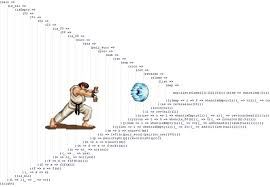
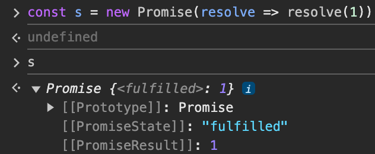
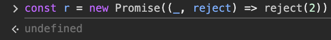
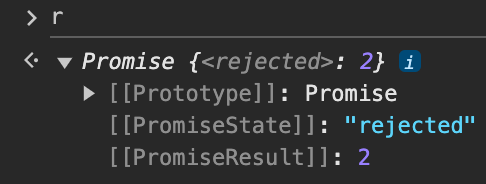

# 45. 프로미스
### 개요

자바스크립트는 비동기 처리를 위한 하나의 패턴으로 “콜백 함수” 사용한다.

### 콜백 함수

```tsx
function callbackFunc() {
	console.log('callback')
}

function func(callback) {
	console.log('hello')
	callback()
}

func(**callbackFunc**)
```

함수의 인자로 전달되어 나중에 실행하는 함수

이렇게 콜백 패턴을 사용하면 콜백 헬로 인해 다음의 단점들이 존재한다.

1. 가독성이 나빠짐
2. 에러 핸들링의 어려움
3. 여러 개의 비동기 처리를 한 번에 처리하는 데 한계

ES6에서는 비동기 처리를 위한 또 다른 패턴으로 “프로미스”를 도입했다.

1. 콜백 패턴이 가진 단점 보완
2. 비동기 처리 시점을 명확하게 표현

## 45.1 비동기 처리를 위한 콜백 패턴의 단점

### 45.1.1 콜백 헬

```tsx
let g = 0

setTimeout(() => { g = 100 }, 0)
console.log(g) // 0
```

`setTimeout`은 비동기 함수이므로 콜백 함수는 setTimeout이 종료된 이후에 실행된다.

⇒ 콜백 함수는 상위 스코프의 변수 `g`에 할당할 수 없다.

```tsx
const get = (url) => {
	const xhr = new XMLHttpRequest()
	xhr.open('GET', url)
	xhr.send()
	
	// 비동기 함수
	xhr.onload = () => {
		if (xhr.status === 200) {
			return JSON.parse(xhr.response)
		}
	}
}

const response = get(url)
console.log(response) // undefined
```

앞의 예시와 마찬가지로 `get` 함수 내 `onload` 이벤트 핸들러는 비동기적으로 동작하기 때문에 `get` 함수가 종료된 이후에 실행된다. 따라서, `response`는 `undefined`가 된다.

<aside>
💡

비동기 함수는 비동기 처리 결과를 외부에 반환할 수 없고, 상위 스코프의 변수에 할당할 수도 없다. 따라서 비동기 함수의 처리 결과에 대한 후속 처리는 비동기 함수 내부에서 수행해야 한다. 이때 비동기 함수를 범용적으로 사용하기 위해 비동기 함수에 비동기 처리 결과에 대한 후속 처리를 수행하는 콜백 함수를 전달하는 것이 일반적이다. 필요에 따라 비동기 처리가 성공하면 호출될 콜백 함수와 비동기 처리가 실패하면 호출될 콜백 함수를 전달할 수 있다.

</aside>

```tsx
const get = (url, successCallback, failureCallback) => {
	const xhr = new XMLHttpRequest()
	xhr.open('GET', url)
	xhr.send()
	
	// 비동기 함수
	xhr.onload = () => {
		if (xhr.status === 200) {
			successCallback(JSON.parse(xhr.response))
		} else {
			failureCallback(xhr.status)
		}
	}
}

get(url, console.log, console.error)
```

이렇게 콜백 함수를 통해 비동기 처리를 하면 콜백 함수 호출이 중첩되어 복잡도가 높아질 수 있다.

⇒ 이를 ‘**콜백 헬**’ 이라 한다.

```tsx
get('/step1', a => { 
	get(`/step2/${a}`, b => { 
		get(`/step3/${b}`, c => { 
			get(`/step4/${c}`, d => { 
				console.log(d);
			});
		});
	});
});
```



### 45.1.2 에러 처리의 한계

```tsx
try {
	setTimeout(() => { throw new Error('Error!') }, 1000)
} catch (e) {
	console.error('에러 캐치', e)
}
```

```tsx
/tmp/main.js:2
	setTimeout(() => { throw new Error('Error!') }, 1000)
	                   ^

Error: Error!
    at Timeout._onTimeout (/tmp/main.js:2:27)
    at listOnTimeout (node:internal/timers:573:17)
    at process.processTimers (node:internal/timers:514:7)

Node.js v20.11.1

[Execution complete with exit code 1]
```

setTimeout의 실행 컨텍스트가 콜 스택에서 pop되고, 

```tsx
() => { throw new Error('Error!') }
```

콜백 함수가 실행되기 때문에 try catch 로 에러를 캐치할 수 없다.

## 45.2 프로미스의 생성

ES6에서 도입된 Promise는 호스트 객체가 아닌 ECMAScript 사양에 정의된 표준 빌트인 객체이다.

Promise 생성자 함수는 비동기 처리를 수행할 콜백 함수를 인수로 받는데 `resolve`와 `reject` 함수를 인수로 받는다.

```tsx
const promise = new Promise((resolve, reject) => {
	if ( success ) {
		resolve('successed')
	} else {
		reject('rejected')
	}
})
```

이 Promise 객체를 통해 get을 다시 구현해보자.

```tsx
const promiseGet = url => {
	return new Promise((resolve, reject) => {
		const xhr = new XMLHttpResponse()
		xhr.open('GET', url)
		xhr.send()
		
		xhr.onload = () => {
			if (xhr.status === 200) [
				resolve(JSON.parse(xhr.response))
			} else {
				reject(new Error(xhr.statue))
			}
		}
	})
}

promiseGet(url) // promise를 반환하는 함수
```

프로미스는 이러한 비동기 처리가 어떻게 진행되고 있는지를 나타내는 status (상태)를 가지고 있다.

- pending
    - 비동기 처리가 아직 수행되지 않았음
- fulfilled
    - resolve 함수 호출 → 비동기 처리가 성공함
- rejected
    - reject 함수 호출 → 비동기 처리가 실패함

> fulfilled와 rejected 상태를 settled 상태라고 함. 즉, 비동기 처리가 수행된 상태
> 







⇒ 즉, 프로미스는 비동기 처리 상태와 처리 결과를 관리하는 객체다.

## 45.3 프로미스의 후속 처리 메서드

프로미스가 fulfilled, reject되면 후속 처리를 해줘야 한다. 이를 위해 `then`, `catch`, `finally` 후속 메서드가 존재한다.

example 1 )

```tsx
new Promise(res => res(1))
	.then(v => console.log(v))
	.finally(() => console.log('finally'))
	
new Promise((_, rej) => rej(2))
	.catch(e => console.log(e))
	.finally(() => console.log('finally'))
		
// 1
// 2
// finally
// finally
```

> then, catch, finally 메서드 모두 **프로미스를 반환**한다.
> 

example 2 )

```tsx
new Promise((_, rej) => rej(2))
	.then(undefined, console.log) // 2
```

- then method는 두 가지를 인자로 받는다
    - fulfilled가 됐을 때의 처리
    - reject가 됐을 때의 처리

> 하지만, catch method가 존재하므로 비추천
> 

## 45.4 프로미스의 에러 처리

```tsx
new Promise(res => res(1))
	.then(v => console.xxx(v))
	.catch(e => console.log(e))
	
// TypeError: console.xxx is not a function
// at <anonymous>:2:21
```

catch 메서드를 사용하면 then 메서드에서 발생한 에러도 캐치할 수 있음

⇒ 에러 핸들링을 위해 then 메서드는 따라서 비추천

catch 메서드는 내부적으로 `then(undefined, onRejected)`를 호출한다.

## 45.5 프로미스 체이닝

```tsx
promise()
	.then(something)
	.then(something)
	.catch(something)
	.then(something)
	.finally(something)
```

위에서 then, catch, finally 메서드는 프로미스를 반환한다고 했다.

따라서, 다음과 같이 프로미스를 연속적으로 호출할 수 있으며, 이를 “프로미스 체이닝”이라고 한다.

Promise를 사용하더라도 콜백 패턴이 사용되기 때문에 가독성에 좋지 않다.

ES8에서 도입된 async/await 을 통해 해결할 수 있다.

```tsx
// IIFE
(async () => {
	const { userId } = await get(url)
	
	const info = await get(`${url}/${userId}`)
	
	console.log(info)
})()
```

## 45.6 프로미스의 정적 메서드

### 45.6.1 Promise.resolve / Promise.reject

이미 존재하는 값을 래핑하여 프로미스를 생성하기 위해 사용한다.

```tsx
const resPromise = Promise.resolve([1, 2, 3])
resPromise
	.then(console.log) // [1, 2, 3]
```

```tsx
const rejPromise = Promise.reject([1, 2, 3])
	.catch(console.log) // [1, 2, 3]
```

### 45.6.2 Promise.all

여러 개의 비동기 처리를 모두 병렬처리할 때 사용

```tsx
p1.then(res => {
	p2.then(res => {
		p3.then(res => { console.log(res) })
	})
})
```

⇒ 순차적으로 실행

```tsx
Promise.all([p1, p2, p3])
	.then(something)
```

모두 fulfilled 상태가 되면 모든 처리 결과를 배열에 저장해 새로운 프로미스를 반환

첫 번째 프로미스가 resolve한 처리 결과부터 차례대로 배열에 저장하므로 순서가 보장되어 있으며, 하나라도 reject되면 나머지 프로미스가 fulfilled 상태가 되는 것을 기다리지 않고 즉시 종료한다.

### 45.6.3 Promise.race

Promise.all처럼 모두 fulfilled되는 것을 기다리지 않는다. 가장 먼저 fulfilled 상태가 된 프로미스의 처리 결과를 resolve하는 새로운 프로미스를 반환한다.

```tsx
Promise.race([
	new Promise(res => setTimeout(() => {  res(3) }), 3000)
	new Promise(res => setTimeout(() => {  res(2) }), 2000)
	new Promise(res => setTimeout(() => {  res(1) }), 1000)
])
	.then(console.log) // 1
```

rejected되면 Promise.all과 마찬가지로 즉시 종료하고, reject하는 새로운 프로미스를 즉시 반환한다.

### 45.6.4 Promise.allSettled

fulfilled 또는 rejected 상태와 상관없이 모든 결과를 담는다

```tsx
Promise.allSettled([p1, p2, p3])
	.then(console.log)

[
	{status: "fulfilled", value: 2},
	{status: "fulfilled", value: 3},
	{status: "rejected", reason: Error: Error! at <anonymous>:3:54 },
]
```

## 45.7 마이크로태스트 큐

```tsx
setTimeout(() => console.log(1), 0)

Promise.resolve()
	.then(() => console.log(2))
	.then(() => console.log(3))
	
// 2 -> 3 -> 1
```

Promise의 후속 처리 메서드의 콜백 함수는 태스크 큐가 아닌 마이크로태스크 큐에 저장되기 때문이다.

- 마이크로태스크 큐는 태스크 큐보다 우선순위가 높기 때문이다.

## 45.8 fetch

fetch 함수는 XMLHttpRequest 객체와 마찬가지로 HTTP 요청 전송 기능을 제공하는 클라이언트 사이드 Web API다.

```tsx
const promise = fetch(url, [, options])
```

HTTP 응답을 나타내는 response 객체를 래핑한 Promise 객체를 반환한다.

```tsx
fetch(url)
	.then(response => response.json())
	.then(json => console.log(json))
```

Response.prototype.json 메서드를 사용하면 Response 객체에서 HTTP 응답 몸체를 취득하여 deserialization(역직렬화) 한다.

https://developer.mozilla.org/ko/docs/Web/API/Fetch_API