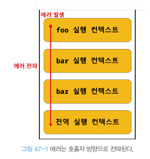

# 47. 에러처리

## 47.1 에러 처리의 필요성

에러가 발생하지 않는 코드를 작성하는 것은 불가능하다.

하지만, 에러에 대처하지 않는다면 프로그램은 강제 종료된다.

```tsx
console.log('start')

foo() // foo is not defined

console.log('end') // 실행되지 않음
```

```tsx
console.log('start')
try {
	foo()
} catch(e) {
	console.log('[에러 발생]', e)
}
console.log('end')

start
[에러 발생] ReferenceError: foo is not defined
    at Object.<anonymous> (/tmp/main.js:4:2)
    at Module._compile (node:internal/modules/cjs/loader:1376:14)
    at Module._extensions..js (node:internal/modules/cjs/loader:1435:10)
    at Module.load (node:internal/modules/cjs/loader:1207:32)
    at Module._load (node:internal/modules/cjs/loader:1023:12)
    at Function.executeUserEntryPoint [as runMain] (node:internal/modules/run_main:135:12)
    at node:internal/main/run_main_module:28:49
end
```

try catch를 사용하면 프로그램이 강제 종료되지 않고 코드를 실행시킬 수 있다.

## 47.2 try … catch … finally 문

에러를 처리하는 방법으로는 크게 두 가지가 존재한다.

1. 반환하는 값을 if 문 등을 통해 에러가 발생하면 에러 처리 코드로 점프

```tsx
const num = func()
if (num === -1) {
	console.log('에러가 발생했습니다.')
} else {
	console.log('에러가 발생하지 않았습니다.')
}
```

1. try, catch, finally 문 사용하기 [일반적으로 에러 처리라고 부름]

```tsx
console.log('start')
try {
	foo()
} catch(e) {
	console.log('[에러 발생]', e)
}
console.log('end')
```

1. try 블록 실행
2. 에러가 발생하면 에러는 catch 문의 err 변수에 전달
3. catch 코드 블록 실행
4. finally 코드 블록은 에러 발생과 상관없이 반드시 한 번 실행됨

## 47.3 Error 객체

Error 생성자 함수는 에러 객체를 생성한다.

```tsx
const error = new Error('invalid')
```

Error 객체

- message
    - Error 생성자 함수에 인자로 전달한 에러 메시지
- stack
    - 에러를 발생시킨 콜스택의 호출 정보 문자열

추가적으로 자바스크립트는 Error 생성자 함수를 포함한 7가지 에러 객체를 생성할 수 있는 Error 생성자 함수 제공

- Error
- SyntaxError
    - 문법
- ReferenceError
    - 참조할 수 없는 식별자
- TypeError
    - 데이터 타입
- RangeError
    - 숫자값의 허용 범위를 벗어났을 때
- URIError
    - encodeURI 또는 decodeURI 함수에 부적절한 인수
- EvalError
    - eval 함수에서 발생하는 에러

## 47.4 throw 문

Error 생성자 함수로 에러 객체를 생성한다고 에러가 발생하는건 아니다.

에러를 발생시키기 위해서 try 코드 블록 내에서 throw 문으로 에러 객체를 던지면 된다.

```tsx
try {
	throw new Error('err')
} catch (e) {
	console.log(e) // err
}
```

## 47.5 에러의 전파



```tsx
const foo = () => {
	throw Error('foo')
}

const bar = () => {
	foo()
}

const baz = () => {
	bar()
}

try {
	baz()
} catch(err) {
	console.log(err) // foo
}

Error: foo
    at foo (/tmp/main.js:2:8)
    at bar (/tmp/main.js:6:2)
    at baz (/tmp/main.js:10:2)
    at Object.<anonymous> (/tmp/main.js:14:2)
    at Module._compile (node:internal/modules/cjs/loader:1376:14)
    at Module._extensions..js (node:internal/modules/cjs/loader:1435:10)
    at Module.load (node:internal/modules/cjs/loader:1207:32)
    at Module._load (node:internal/modules/cjs/loader:1023:12)
    at Function.executeUserEntryPoint [as runMain] (node:internal/modules/run_main:135:12)
    at node:internal/main/run_main_module:28:49
```

다음과 같이 에러는 전파되어 전역에서 캐치되게 된다.

여기서 주의할 점은 비동기 함수 setTimeout이나 프로미스 후속 처리 메서드의 콜백 함수는 테스트 큐나 마이크로테스트 큐에 저장되었다가 콜 스택이 비면 이벤트 루프에 의해 콜 스택에 푸시되어 실행하기 때문에 에러 전파할 호출자가 존재하지 않는다.